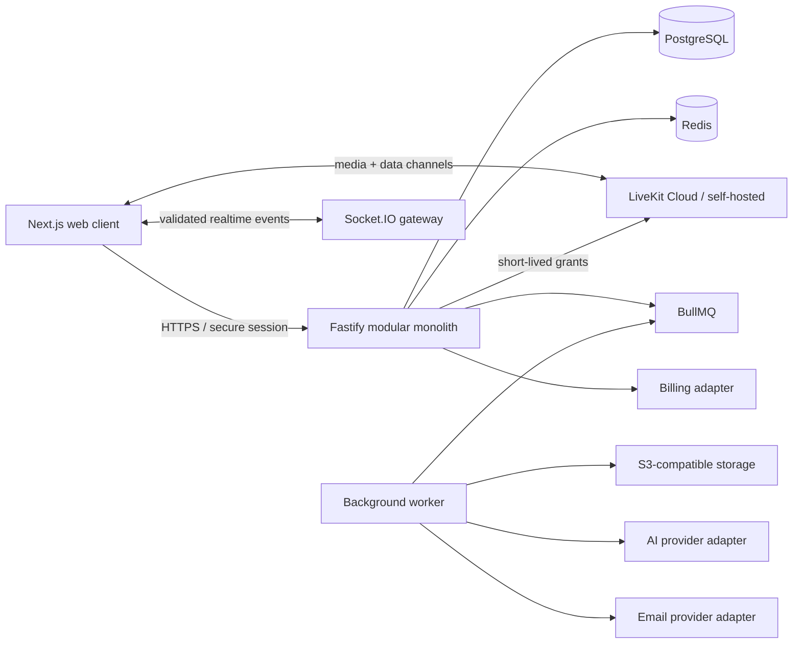

# Laminaria architecture

## System context

## Boundaries

- `apps/web`: App Router user experience, localized routing, accessible components, Query cache,
  webinar-local Zustand state, and LiveKit React components.
- `apps/api`: authentication, sessions, workspaces, RBAC, webinar lifecycle, public registrations,
  signed LiveKit grants, Socket.IO validation, OpenAPI, and audit events.
- `apps/worker`: idempotent email, AI, recording, export, webhook retry, and cleanup jobs.
- `packages/contracts`: Zod DTOs, event contracts, enums, and shared types.
- `packages/config`: the only source of plan capabilities and feature gates.
- `packages/localization`: English and Russian message catalogs.
- `packages/ui`: Laminaria tokens and reusable accessible primitives.
- `prisma`: PostgreSQL schema and append-only migrations.

## Core invariants

1. `DRAFT -> SCHEDULED -> LIVE -> ENDED` is the only normal webinar progression. `CANCELLED` and
   `ARCHIVED` have explicit guards. An ended webinar is never restarted.
2. LiveKit secrets and provider keys never enter the browser bundle or database.
3. Every workspace/webinar query is scoped by authenticated membership and role.
4. ATTENDEE and GUEST grants cannot publish media. Promotion to SPEAKER produces a new server grant.
5. All externally retried and critical commands require an idempotency key.
6. Realtime content is normalized, validated, moderated, persisted, and only then broadcast.
7. Exactly three plans exist; prices stay `null` until the business approves them.
8. English is canonical, Russian is complete, and locale switching preserves the current route.

## Deployment model

Deploy web as an independent Next.js service. Deploy API as a continuously running Node process with
sticky or Redis-backed Socket.IO coordination. Deploy worker independently. Use managed PostgreSQL,
Redis, object storage, and LiveKit for the MVP. Secrets belong in the platform secret manager.
