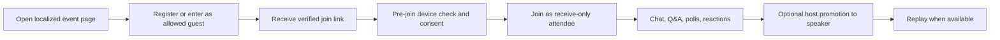

# Laminaria user flows

## Organizer

```mermaid
flowchart LR
  A["Create account"] --> B["Verify email"] --> C["Create workspace"]
  C --> D["Create draft webinar"] --> E["Configure access and features"]
  E --> F["Schedule and publish"] --> G["Open pre-flight room"]
  G --> H["Start webinar"] --> I["Moderate and present"]
  I --> J["End webinar"] --> K["Recording, analytics, export, AI summary"]
```

## Attendee

## Failure paths

- Device permission denied: explain the exact browser setting and offer receive-only entry.
- Offline or lost websocket: keep pending commands keyed, reconnect with backoff, reconcile from API.
- LiveKit unavailable: retain registration and content access; show a typed connection state.
- AI, storage, mail, or billing unconfigured: disable only that capability and link to workspace setup.
- Full/cancelled/expired event: deny entry server-side and show a localized recovery action.
